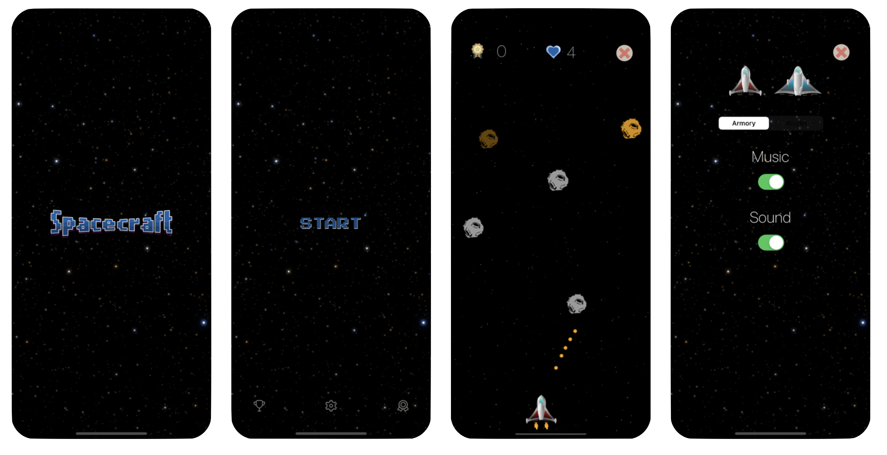

# 
A classic and simple spaceship game exclusively for iPhone, localized in three languages: Portuguese, English, and Spanish. The project began in Belém, Brazil, in December 2016 and is licensed under the [MIT License](LICENSE). Since then, Spacecraft has been downloaded nearly a thousand times. The game was available on the App Store between 2016 and 2023. Initially published on my old GitHub account, it has been refactored with minor adjustments and is now a public and archived project on GitHub and should be used only as a reference for studying the use of GameKit.
 
 
 
## An Interstellar Adventure
The Starbot pilots the spaceships Armory and Rinzler, battling a meteor shower in Spacecraft. Control the spaceship using the iPhone's accelerometer and touch the screen to shoot meteors. You can earn extra lives and compete with friends via [Game Center](https://developer.apple.com/game-center/).

## Some technical details
To create this game, the IDE used was Xcode with Apple's libraries: [Foundation](https://developer.apple.com/documentation/foundation), [SpriteKit](https://developer.apple.com/documentation/spritekit), [GameKit](https://developer.apple.com/documentation/gamekit), and [UIKit](https://developer.apple.com/documentation/uikit). Storyboard was used for the navigation menus, while View Code was used for the GameScenes, GameObjects, and GameActions. The soundtrack was composed in GarageBand and later edited in Logic Pro X. The assets and sprites were drawn using Gimp and Pixelmator Pro.
